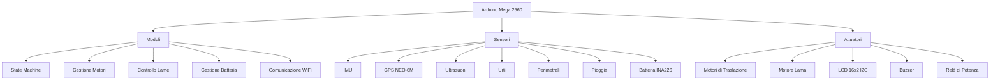

# 🤖 MowerArduino - Robot Tagliaerba Autonomo

[](https://opensource.org/licenses/MIT)
[](https://store.arduino.cc/products/arduino-mega-2560-rev3)
[](https://github.com/evlas/MowerArduino)

Un sistema avanzato per robot tagliaerba autonomo basato su **Arduino Mega 2560**, progettato per offrire un taglio preciso e intelligente del prato con il massimo dell'autonomia e della sicurezza.

## 🌟 Novità (v0.1.0)

- **Gestione del Relay** per il controllo dell'alimentazione dei motori
- **Documentazione Doxygen** completa per le classi principali
- **Miglioramento della StateMachine** per una gestione più robusta degli stati
- **Refactoring del codice** per ridurre l'accoppiamento tra i componenti

## 🏗 Architettura del Sistema



## 🚀 Funzionalità Principali

### 🧭 Navigazione e Controllo
- **Macchina a Stati** per la gestione delle operazioni
- **Controllo dei Motori** con supporto per motori brushless
- **Gestione del Relay** per la sicurezza dell'alimentazione
- **Navigazione Intelligente** con evitamento ostacoli

### ⚡ Gestione Energia
- Monitoraggio batteria con INA226
- **Gestione del Relay** per il risparmio energetico
- Spegnimento automatico in caso di bassa tensione

### 🔒 Sicurezza
- **Protezione da sovracorrente**
- **Arresto di emergenza**
- **Controlli di sicurezza** integrati
- **Gestione del Relay** per isolare i componenti quando non in uso

## 🛠 Struttura del Codice

```
src/
├── LCD/               # Gestione display LCD
├── actuators/         # Attuatori (relay, buzzer, ecc.)
├── battery/          # Gestione batteria e alimentazione
├── communications/    # Comunicazione WiFi e seriale
├── error/            # Gestione errori
├── functions/        # Funzionalità principali
│   └── StateMachine.cpp/h  # Macchina a stati principale
├── handler/          # Gestori di sistema
├── motors/           # Controllo motori e lame
├── position/         # Gestione posizione
├── safety/           # Funzioni di sicurezza
└── sensors/          # Gestione sensori
```

## 🔧 Installazione e Configurazione

1. **Prerequisiti**
   - Arduino IDE 1.8.x o successiva
   - **Librerie richieste**:
     ```bash
     Wire.h (inclusa nell'IDE Arduino)
     LiquidCrystal_I2C.h
     INA226_WE.h
     ArduinoJson.h
     DS1302.h
     ```

2. **Configurazione**
   - Clonare la repository
   - Aprire `MowerArduino.ino` con Arduino IDE
   - Installare le librerie richieste
   - Configurare `config.h` e `pin_config.h`
   - Selezionare "Arduino Mega or Mega 2560"
   - Compilare e caricare il firmware

## 📊 Stato del Progetto

| Componente           | Stato       | Note                                      |
|----------------------|-------------|------------------------------------------|
| Hardware            | ✅ Completato |                                          |
| Core Firmware       | ✅ Completato | Gestione base del sistema                |
| State Machine       | ✅ Completato | Gestione stati e transizioni             |
| Gestione Relay      | ✅ Completato | Controllo alimentazione motori           |
| Controllo Motori    | 🟡 In Sviluppo |                                          |
| Navigazione         | 🟡 In Sviluppo |                                          |
| Documentazione      | 🟡 In Corso  | In corso di completamento                 |


## 📋 Roadmap

### 🚩 Prossimi Passi
- [ ] Completamento documentazione Doxygen
- [ ] Test approfonditi del sistema di gestione relay
- [ ] Implementazione algoritmi di navigazione
- [ ] Interfaccia utente avanzata

### 🔮 Futuro
- Integrazione con sistemi domotici
- App mobile dedicata
- Ottimizzazione percorsi di taglio

## 🤝 Contributi

I contributi sono benvenuti! Per favore leggi le [linee guida per i contributi](CONTRIBUTING.md) prima di inviare una pull request.

## 📄 Licenza

Questo progetto è rilasciato sotto licenza MIT. Vedi il file `LICENSE` per i dettagli.

---

<div align="center">
  Creato con ❤️ per gli amanti del giardino perfetto
</div>
