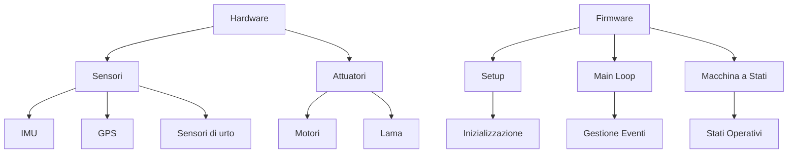

# 🤖 MowerArduino - Robot Tagliaerba Autonomo

[](https://opensource.org/licenses/MIT)
[](https://www.arduino.cc/)
[](https://www.espressif.com/)

Un sistema avanzato per robot tagliaerba autonomo basato su Arduino/ESP32, progettato per offrire un taglio preciso e intelligente del prato con il massimo dell'autonomia e della sicurezza.

## 🌟 Caratteristiche Principali

- **Navigazione Intelligente** con sensori avanzati
- **Taglio Efficace** con gestione ottimizzata delle lame
- **Sicurezza Avanzata** con rilevamento ostacoli e protezioni
- **Controllo Remoto** via WiFi
- **Gestione Batteria** con ricarica automatica
- **Architettura Modulare** per facile personalizzazione

## 🏗 Architettura del Sistema



## 🚀 Funzionalità

### 🧭 Navigazione
- Mappatura dell'area di lavoro
- Evitamento ostacoli
- Percorsi efficienti
- Ritorno automatico alla base

### ⚡ Energia
- Monitoraggio batteria
- Ricarica automatica
- Gestione del consumo

### 🔒 Sicurezza
- Rilevamento ostacoli
- Protezione lama
- Arresto di emergenza
- Controlli integrità

## 🛠 Installazione

1. **Prerequisiti**
   - Arduino IDE 2.x
   - Librerie richieste:
     ```bash
     Adafruit_GFX
     Adafruit_SSD1306
     ESP32Servo
     ```

2. **Configurazione**
   - Copiare `config.example.h` in `config.h`
   - Personalizzare le impostazioni
   - Compilare e caricare

## 📊 Stato del Progetto

| Categoria | Stato |
|-----------|-------|
| Hardware | ✅ Completato |
| Firmware Base | ✅ Completato |
| Navigazione | 🟡 In Sviluppo |
| Interfaccia Web | 🟡 In Sviluppo |
| Documentazione | 🟡 In Sviluppo |

## 📋 Roadmap

### 🎯 Prossime Versioni
- [x] Sistema base di navigazione
- [ ] Integrazione sensori avanzati
- [ ] Interfaccia web completa
- [ ] Supporto multi-lingua

### 🔮 Futuro
- Integrazione con sistemi domotici
- App mobile dedicata
- Machine learning per percorsi ottimizzati

## 🤝 Contributi

I contributi sono benvenuti! Per favore leggi le [linee guida per i contributi](CONTRIBUTING.md) prima di inviare una pull request.

## 📄 Licenza

Questo progetto è rilasciato sotto licenza MIT. Vedi il file `LICENSE` per i dettagli.

## 🙋 Supporto

Per domande o supporto, apri una [issue](https://github.com/tu-utente/MowerArduino/issues) sulla repository.

---

<div align="center">
  Creato con ❤️ per gli amanti del giardino perfetto
</div>
