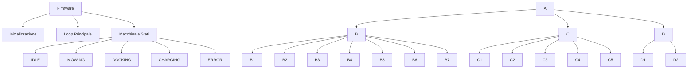

# 🤖 MowerArduino - Robot Tagliaerba Autonomo

[](https://opensource.org/licenses/MIT)
[](https://store.arduino.cc/products/arduino-mega-2560-rev3)
[](https://github.com/evlas/MowerArduino)

Un sistema avanzato per robot tagliaerba autonomo basato su **Arduino Mega 2560**, progettato per offrire un taglio preciso e intelligente del prato con il massimo dell'autonomia e della sicurezza.

## 🌟 Caratteristiche Principali

- **Navigazione Intelligente** con sensori avanzati
- **Taglio Efficace** con gestione ottimizzata delle lame
- **Sicurezza Avanzata** con rilevamento ostacoli e protezioni
- **Controllo Remoto** via WiFi
- **Gestione Batteria** con ricarica automatica
- **Architettura Modulare** per facile personalizzazione

## 🏗 Architettura del Sistema



## 🚀 Funzionalità

### 🧭 Navigazione
- Mappatura dell'area di lavoro
- Evitamento ostacoli
- Percorsi efficienti
- Ritorno automatico alla base

### ⚡ Energia
- Monitoraggio batteria
- Ricarica automatica
- Gestione del consumo

### 🔒 Sicurezza
- Rilevamento ostacoli
- Protezione lama
- Arresto di emergenza
- Controlli integrità

## 🛠 Installazione

1. **Prerequisiti**
   - Arduino IDE 1.8.x o successiva
   - **Librerie richieste**:
     ```bash
     Wire.h (inclusa nell'IDE Arduino)
     LiquidCrystal_I2C.h
     INA226_WE.h
     ArduinoJson.h
     DS1302.h
     ```
   - **Hardware richiesto**:
     - Scheda Arduino Mega 2560
     - Modulo WiFi ESP8266 per la connettività
     - Modulo GPS NEO-6M
     - Sensore IMU (es. MPU6050)
     - Modulo INA226 per il monitoraggio della batteria
     - Display LCD I2C 16x2
     - Motori brushless con controller a bordo a 5 fili (es: 42GP-4260)

2. **Configurazione**
   - Clonare la repository
   - Aprire il file `MowerArduino.ino` con Arduino IDE
   - Installare le librerie richieste tramite il Gestore Librerie
   - Configurare i parametri in `config.h` e `pin_config.h`
   - Selezionare la scheda "Arduino Mega or Mega 2560"
   - Selezionare la porta corretta
   - Compilare e caricare il firmware

3. **Configurazione WiFi**
   - Il modulo ESP8266 deve essere configurato
   - La comunicazione avviene tramite Serial2 (pin 16 RX2, 17 TX2)

## 📊 Stato del Progetto

| Categoria | Stato |
|-----------|-------|
| Hardware | ✅ Completato |
| Firmware Base | ✅ Completato |
| Navigazione | 🟡 In Sviluppo |
| Interfaccia Web | 🟡 In Sviluppo |
| Documentazione | 🟡 In Sviluppo |

## 📋 Roadmap

### 🎯 Prossime Versioni
- [x] Sistema base di navigazione
- [ ] Integrazione sensori avanzati
- [ ] Interfaccia web completa
- [ ] Supporto multi-lingua

### 🔮 Futuro
- Integrazione con sistemi domotici
- App mobile dedicata
- Machine learning per percorsi ottimizzati

## 🤝 Contributi

I contributi sono benvenuti! Per favore leggi le [linee guida per i contributi](CONTRIBUTING.md) prima di inviare una pull request.

## 📄 Licenza

Questo progetto è rilasciato sotto licenza MIT. Vedi il file `LICENSE` per i dettagli.

## 🙋 Supporto

Per domande o supporto, apri una [issue](https://github.com/tu-utente/MowerArduino/issues) sulla repository.

---

<div align="center">
  Creato con ❤️ per gli amanti del giardino perfetto
</div>
