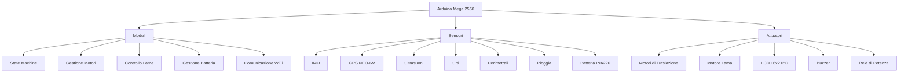

# 🤖 MowerArduino - Robot Tagliaerba Autonomo

[](https://opensource.org/licenses/MIT)
[](https://store.arduino.cc/products/arduino-mega-2560-rev3)
[](https://github.com/evlas/MowerArduino)
[](https://evlas.github.io/MowerArduino/)

Un sistema avanzato per robot tagliaerba autonomo basato su **Arduino Mega 2560**, progettato per offrire un taglio preciso e intelligente del prato con il massimo dell'autonomia e della sicurezza.

> **Note:** Questo progetto è in attivo sviluppo. La documentazione viene aggiornata regolarmente.

## 🌟 Novità (v0.2.0)

- **Documentazione Doxygen** completa per tutte le classi principali
- **Sistema di gestione stati** completamente documentato
- **API Reference** generata automaticamente
- **Miglioramenti alla sicurezza** nel controllo dei motori
- **Gestione errori** migliorata con codici di errore specifici
- **Aggiornamento delle dipendenze** alle ultime versioni

## 🏗 Architettura del Sistema



## 🚀 Funzionalità Principali

### 🧭 Navigazione e Controllo
- **Macchina a Stati** per la gestione delle operazioni
- **Controllo dei Motori** con supporto per motori brushless
- **Navigazione Intelligente** con evitamento ostacoli
- **Sensori di prossimità** per il rilevamento ostacoli

### ⚡ Gestione Energia
- Monitoraggio batteria con **INA226**
- **Risparmio energetico** con gestione avanzata dello sleep
- **Ricarica automatica** con rilevamento dock
- **Spegnimento sicuro** in caso di bassa tensione

### 🔒 Sicurezza
- **Arresto di emergenza** con tasto fisico
- **Protezione da sovracorrente**
- **Rilevamento sollevamento**
- **Blocco lame automatico** in caso di pericolo
- **Monitoraggio continuo** di tutti i sensori

## 🏗 Architettura del Codice

```
src/
├── actuators/         # Attuatori (relay, buzzer, ecc.)
│   ├── Buzzer/       # Gestione cicalino
│   └── Relay/        # Gestione relè di potenza
├── config/           # File di configurazione
├── functions/        # Funzionalità principali
│   └── Mower.h/cpp   # Classe principale
├── motors/           # Controllo motori
│   ├── BladeMotor/   # Gestione motore lama
│   └── DriveMotor/   # Gestione motori di trazione
├── sensors/          # Gestione sensori
│   ├── BatterySensor/ # Monitoraggio batteria
│   ├── BumpSensors/  # Sensori urto
│   └── Ultrasonic/   # Sensori ad ultrasuoni
└── states/           # Macchina a stati
    ├── ChargingState.h
    ├── DockingState.h
    ├── EmergencyStopState.h
    ├── ErrorState.h
    ├── IdleState.h
    ├── LiftedState.h
    ├── MowingState.h
    └── MowerState.h  # Interfaccia base
```

## 📚 Documentazione

La documentazione completa è disponibile in formato Doxygen. Puoi generarla localmente con:

```bash
# Installare Doxygen
sudo apt-get install doxygen graphviz

# Generare la documentazione
doxygen Doxyfile

# Aprire la documentazione nel browser
xdg-open docs/html/index.html
```

Oppure consultare la versione online: [Documentazione Online](https://evlas.github.io/MowerArduino/)

## 🔧 Installazione e Configurazione

1. **Prerequisiti**
   - Arduino IDE 1.8.x o successiva
   - **Librerie richieste**:
     ```bash
     Wire.h (inclusa nell'IDE Arduino)
     LiquidCrystal_I2C.h
     INA226_WE.h
     ArduinoJson.h
     DS1302.h
     ```

2. **Configurazione**
   - Clonare la repository
   - Aprire `MowerArduino.ino` con Arduino IDE
   - Installare le librerie richieste
   - Configurare `config.h` e `pin_config.h`
   - Selezionare "Arduino Mega or Mega 2560"
   - Compilare e caricare il firmware

## 🚀 Quick Start

1. **Clonare il repository**
   ```bash
   git clone https://github.com/evlas/MowerArduino.git
   cd MowerArduino
   ```

2. **Installare le dipendenze**
   - Arduino IDE 2.x
   - Librerie richieste (gestite tramite PlatformIO):
     - `LiquidCrystal I2C`
     - `INA226_WE`
     - `ArduinoJson`

3. **Aprire il progetto**
   - Aprire `MowerArduino.ino` con Arduino IDE
   - Selezionare la scheda "Arduino Mega or Mega 2560"
   - Configurare i parametri in `config.h`

4. **Caricare il firmware**
   - Collegare la scheda Arduino
   - Compilare e caricare lo sketch

## 📊 Stato del Progetto

| Componente               | Stato         | Note                                      |
|--------------------------|---------------|------------------------------------------|
| Hardware                | ✅ Completato  |                                          |
| Core Firmware           | ✅ Completato  | Gestione base del sistema                |
| State Machine           | ✅ Completato  | Documentazione completa                  |
| Documentazione API      | ✅ Completato  | Generata con Doxygen                     |
| Controllo Motori        | ✅ Completato  | Con protezioni integrate                  |
| Gestione Batteria       | ✅ Completato  | Monitoraggio INA226                      |
| Navigazione Base        | 🟡 In Sviluppo | Implementazione in corso                  |
| App Mobile              | ⏳ Pianificato | Interfaccia di controllo remoto           |


## 🗺 Roadmap 2025

### 🚩 Prossimi Passi (Q3 2025)
- [x] Completamento documentazione Doxygen
- [ ] Test di integrazione completi
- [ ] Implementazione algoritmi di navigazione
- [ ] Ottimizzazione consumi energetici

### 🎯 Obiettivi Q4 2025
- Integrazione con Home Assistant
- App mobile di controllo
- Mappatura avanzata del giardino
- Supporto multi-lingua

### 🔮 Visione Futura
- Integrazione con assistenti vocali
- Machine learning per ottimizzazione percorsi
- Manutenzione predittiva
- Supporto per swarming (più robot coordinati)

## 🤝 Come Contribuire

Siamo aperti a contributi! Ecco come puoi aiutare:

1. **Segnala bug** aprendo una [issue](https://github.com/evlas/MowerArduino/issues)
2. **Proponi nuove funzionalità**
3. **Invia una Pull Request** seguendo le [linee guida](CONTRIBUTING.md)
4. **Migliora la documentazione**
5. **Condividi** il progetto con altri appassionati

## 📄 Licenza

Distribuito sotto licenza MIT. Vedi il file [LICENSE](LICENSE) per i dettagli.

## 🙏 Ringraziamenti

- **Comunità Arduino** per il supporto continuo
- **Contributori** che hanno reso possibile questo progetto
- **Beta tester** per il prezioso feedback

---

<div align="center">
  Creato con ❤️ per gli amanti del giardino perfetto | v0.2.0
</div>
